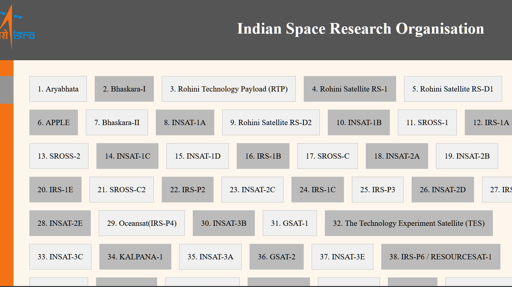
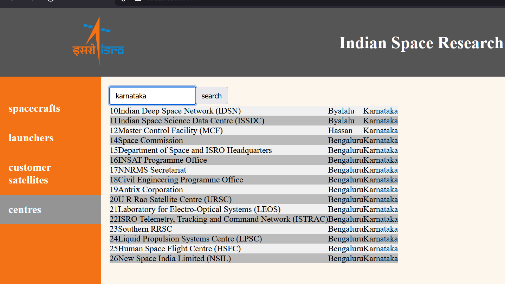

# ISRO Satellites Website

This website displays information about Indian Space Research Organisation (ISRO) satellites using the API provided by https://isro.vercel.app/. The website was built using HTML, CSS, and JavaScript.

## Live Demo

You can view a live demo of the website at https://isro-data-webapplication.netlify.app/.

## Screenshots

Here are some screenshots of the website:

## Installation

To run the website locally, you can follow these steps:

1. Clone the repository: `git clone https://github.com/samhithMR/isro-data-webapplication.git`
2. Open the `index.html` file in your web browser.

## Features

- Spacecraft Information: Browse detailed information on various spacecraft launched by ISRO.
- Launcher Information: Explore a list of all the launch vehicles used by ISRO for its missions.
- Customer Satellites Information: Access detailed information on the customer satellites launched by ISRO.
- Search by Country: Use the search functionality to filter the list of customer satellites based on the country of origin.
- Search by Center: Filter the list of ISRO missions by launch center using the search functionality.
- completely responsive

## Technologies Used

- HTML
- CSS
- JavaScript
